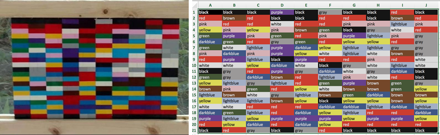

# LegoColor2CSV

Created by Kevin Ponto as part of the “What color is ?” project by Stuart Flack, Kevin Ponto, Travis Tangen and Karen B. Schloss.  

This project is a work in progress.  To use, drop an image on the executable.  Once launched, drag the corners to match up with the corners for the Lego stacks.  For fine-tuned manipulations use the A,S,D, and E keys to move the corners around.  When the grid cells look like they match the lego colors, push 'p' to write the results to csv files.

To find out more about the project, read our paper at:
[LEGO as Language for Visual Communication](osf.io/6fwq4)

## License

This project is licensed under the MIT License - see the [LICENSE.md](LICENSE.md) file for details

